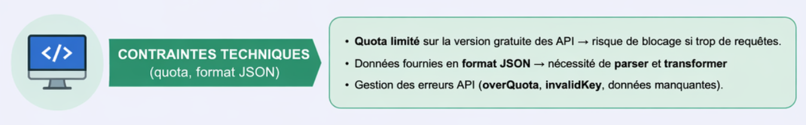

# I. Définition des contraintes du projet

## 1. Introduction

Dans le cadre du projet GoodAir, la mise en place d’une plateforme de collecte et d’analyse de données environnementales nécessite l’identification précise des contraintes associées. Ces contraintes influencent directement les choix d’architecture, de technologies et de méthodes de traitement des données.

L’objectif est de garantir une solution fiable, performante et conforme aux exigences métier et réglementaires.

---

## 2. Contraintes liées à l’accès aux données

Les données exploitées dans le cadre du projet proviennent d’API externes, notamment celles relatives à la qualité de l’air et aux données météorologiques.

L’utilisation de ces API est soumise à des limitations, notamment en termes de nombre de requêtes autorisées. Dans le cadre d’une utilisation gratuite, ces quotas imposent de limiter la fréquence des appels afin d’éviter toute interruption de service.

Cette contrainte implique la mise en place d’un système de planification des requêtes, permettant de réguler les appels et d’optimiser l’utilisation des ressources disponibles.

---

## 3. Contraintes d’historisation des données

Les données fournies par les API sont disponibles en temps réel. Cependant, les besoins du laboratoire nécessitent une analyse dans le temps, impliquant la constitution d’un historique des données.

Pour répondre à cette exigence, il est nécessaire de mettre en place un mécanisme de collecte périodique, par exemple toutes les heures. Chaque récupération doit être stockée de manière incrémentale, sans écrasement des données existantes.

Cette approche permet de suivre l’évolution des indicateurs environnementaux et d’effectuer des analyses comparatives.

---

## 4. Contraintes de volumétrie et de performance

La collecte régulière de données sur plusieurs villes entraîne une augmentation progressive du volume de données stockées. Cette volumétrie croissante nécessite la mise en place d’une architecture capable de s’adapter à l’évolution des besoins.

Il est donc essentiel de concevoir un système scalable, capable de gérer de grandes quantités de données tout en garantissant des performances optimales, notamment en termes de temps de réponse pour les requêtes.

---

## 5. Contraintes de sécurité et de conformité

Le projet doit respecter les exigences en matière de sécurité des données et de conformité réglementaire. Cela inclut la mise en place d’un système d’authentification permettant de contrôler l’accès aux données.

De plus, conformément aux exigences du RGPD, les données doivent être hébergées au sein de l’Union Européenne. Cette contrainte influence directement les choix d’infrastructure et d’hébergement.

---

## 6. Contraintes de qualité et de fiabilité des données

Les données issues d’API externes peuvent présenter des anomalies telles que des valeurs manquantes, incohérentes ou des indisponibilités temporaires.

Il est donc nécessaire d’intégrer des mécanismes de contrôle de qualité au sein du pipeline de traitement. Ces mécanismes permettent de valider les données, de corriger certaines erreurs et de générer des alertes en cas de dysfonctionnement.

---

## 7. Contraintes organisationnelles et méthodologiques

Le projet est réalisé en équipe et doit suivre une approche itérative. La mise en place d’un MVP permet de proposer rapidement une première version fonctionnelle, qui sera ensuite améliorée progressivement.

Cette organisation nécessite une répartition claire des tâches ainsi qu’une coordination efficace entre les membres de l’équipe.

---

## 8. Conclusion

L’ensemble des contraintes identifiées constitue un cadre structurant pour la conception de la solution. Leur prise en compte dès les premières phases du projet permet de garantir la mise en place d’une architecture robuste, évolutive et conforme aux attentes du laboratoire GoodAir.